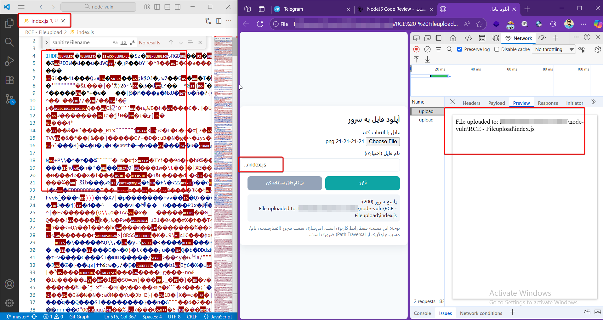

# RCE - FileUpload (Concise)

## Summary

This example demonstrates a **Path Traversal → Arbitrary File Write**: a user-controlled filename allows overwriting files the Node process user can write. The key point I want to highlight is about how the operating system and Node behave when a source file (e.g. `index.js`) is overwritten while Node is running.

## What I expected

I expected the OS to *lock* `index.js` while it was being executed, preventing overwrites or making such overwrites immediately affect the running process (or at least cause a crash). In other words, I expected the file on disk to be protected while the process runs.

## What actually happened (important)

On Windows (dev environment) I could overwrite `index.js` on disk even while `node index.js` was running. The running Node process continued executing the original code (because code is loaded/cached in memory). Only **after a restart** did Node load and execute the overwritten file.
So: **arbitrary file write + restart = attacker code runs.**

## Consequence (short)

An attacker who can overwrite files (via path traversal or writable code files) can persist a backdoor that becomes active once the service is restarted — even if the overwrite did not affect the running process immediately.
